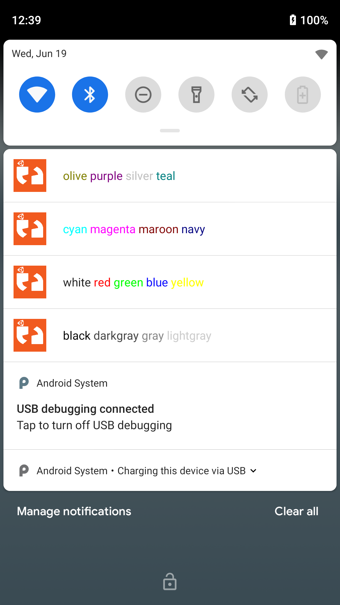

Markup Tags for Android Notification Text
=========================================
HTML-lite tags are available in Android notification text.

Supported Tags
--------------
The following tags are supported:
    :<b>: bold
    :<i>: italic
    :<tt>: monospace
    :<u>: underline
    :<strike>: strikethrough
    :: change text color

    These are how the colors look on a Google Pixel

Supported Colors:
-----------------
The following colors are supported:
    * black
    * darkgray
    * gray
    * lightgray
    * white
    * red
    * green
    * blue
    * yellow
    * cyan
    * magenta
    * maroon
    * navy
    * olive
    * purple
    * silver
    * teal
