Creating and Uploading your Apple Push Notification Service (APNS) Certificates
===============================================================================

Before you Begin
----------------

Before you begin, you will need the following

* A Mac
* An account on the `Apple Developer Site <https://developers.apple.com>`_ with access to your game
* An account on `Teak <https://app.teak.io/login>`_ with access to your game

Navigating the Apple Developer Site
-----------------------------------

To create or update your APNS Certificates/p12 start by logging in to the `Apple Developer Site <https://developers.apple.com>`_ and navigating to **Certificates, IDs & Profiles**

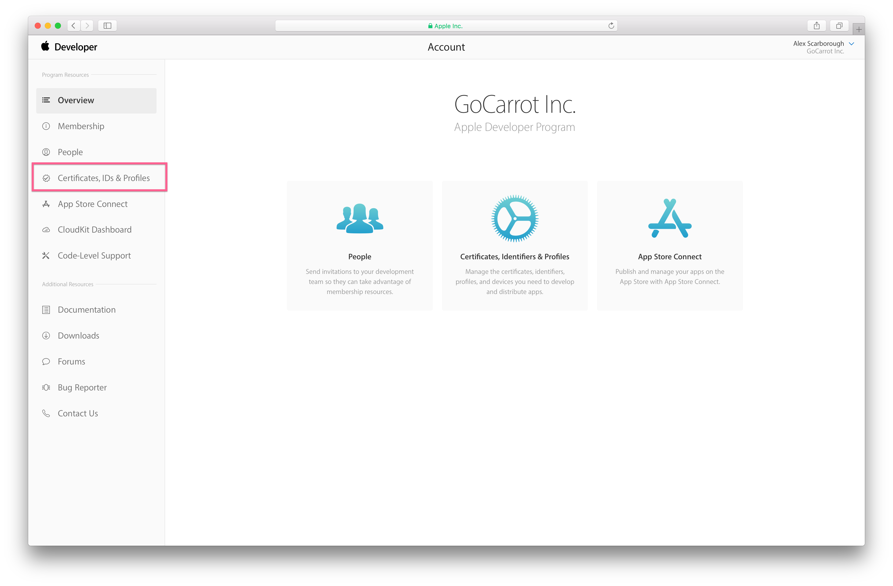

In **Certificates, IDs & Profiles** select **App IDs** in the left hand column.

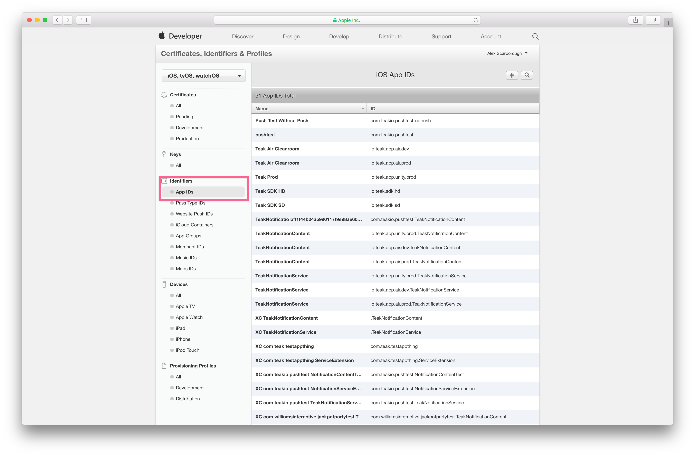

In **App IDs** find the application you need to create or update certificates for. The application will be identified by its name as registered with Apple and by its bundle id. I've found it's easier to look up the app by bundle id. After finding the application, click on it in the list, then scroll down until you see the **Edit** button for the application. Click the **Edit** button.

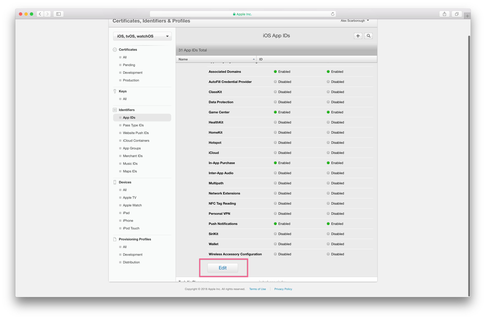

In the settings for the App ID, scroll down to **Push Notifications**. Ensure that they are **Enabled**, and then click **Create Certificate** for either Development SSL Certificate or Production SSL Certificate, depending on which you need to update. I've found that it's best to update both at the same time. That keeps expiration times consistent and means you only have to do this once per year instead of twice.

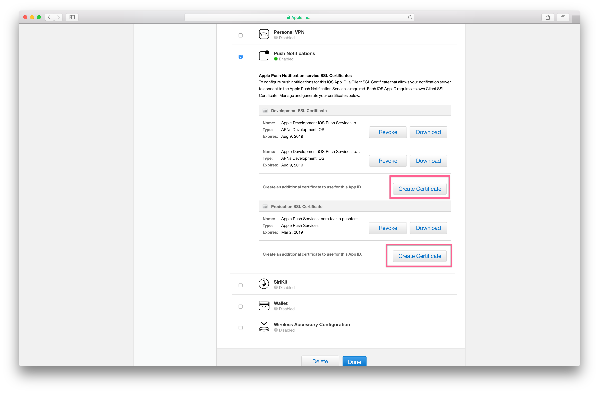

After clicking **Create Certificate** the developer site will instruct you to create a Certificate Signing Request (CSR) in Keychan Access. Let's walk through that now.

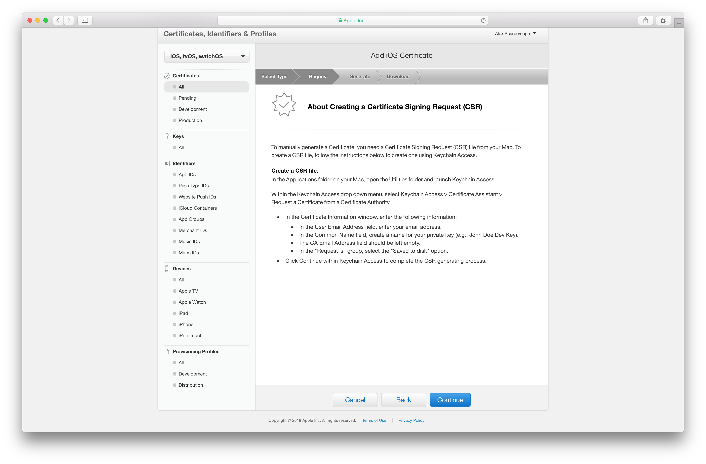

Creating the CSR
----------------

After launching Keychain Access, select **Keychain Access -> Certificate Assitant -> Request a Certificate From a Certificate Authority...** from the menu bar. This will launch the Certificate Assitant modal.

.. image:: images/apns-setup/keychain-access-menu.png

In the Certificate Assistant modal enter your work email address for **User Email Address**. Enter an easy to identify unique name for **Common Name**. This name is how Keychain Access will display your private key in its lists. This name is not used for any other purposes. Leave **CA Email Address** blank. Select **Request is: Saved to disk** and then click **Continue**. You will be prompted to select somewhere to save the CSR. We're going to be uploading the file next, so choose somewhere easy to navigate to!

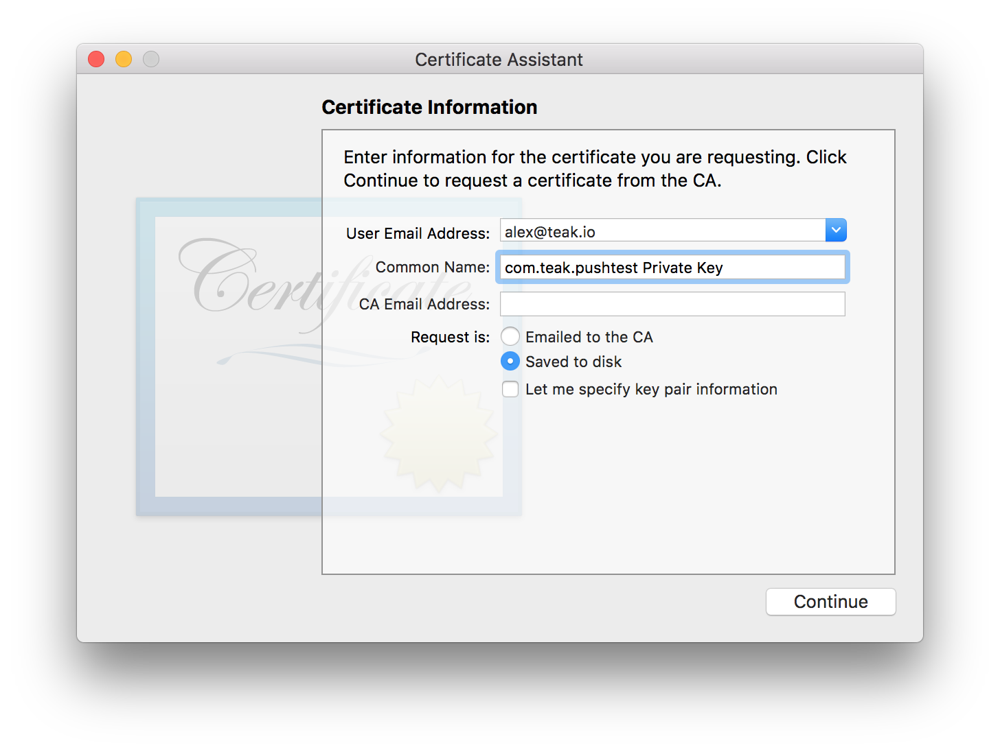

Creating the Certificate
------------------------

Back on the Apple Developer Site, click **Continue** and then upload the CSR you just created. Click **Continue** after uploading the CSR.

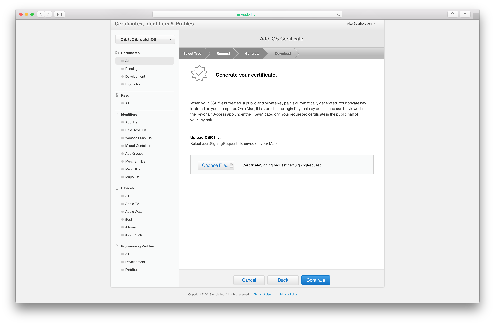

After uploading the CSR, the Apple Developer Site will create the certificate and prompt you to download it. Download the certificate. We're about to open it, so be sure to save it somewhere you can easily navigate to!

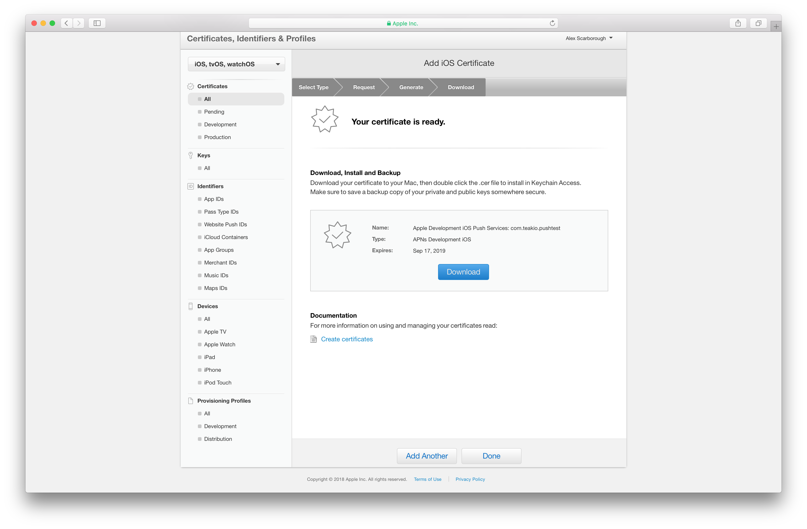

Exporting the p12
-----------------

After downloading the certificate, navigate to it in the finder and double click on it to open it in Keychan Access.

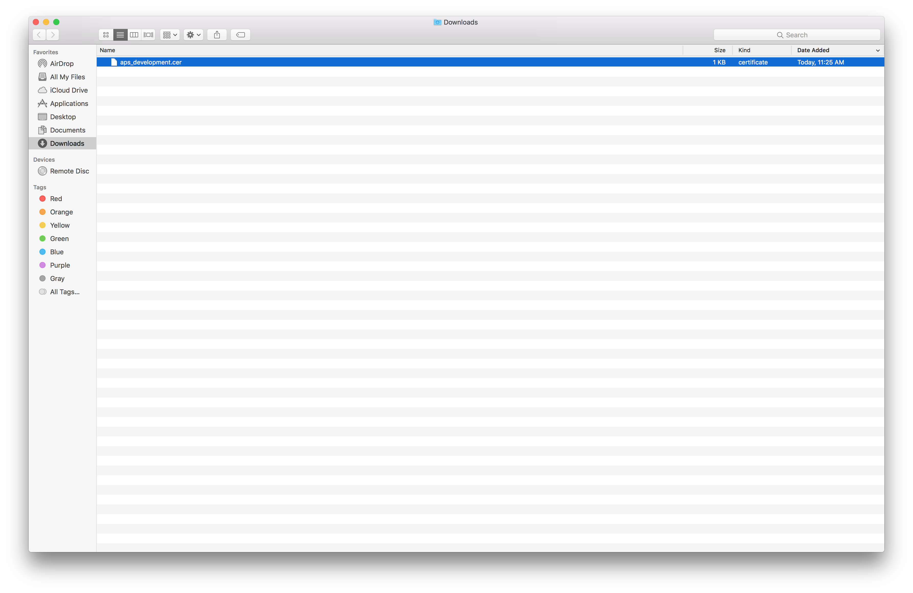

You will be prompted to add the certificate to a keychain. Add it to the default **login** keychain, and click **Add** to continue.

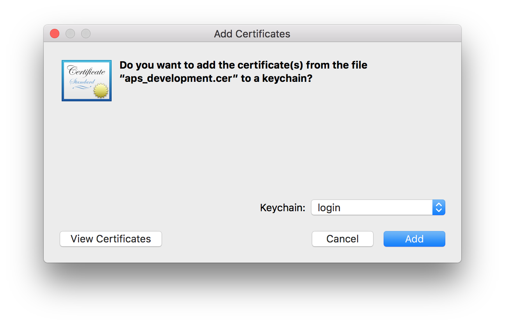

After adding the certificate, in Keychain Access navigate to **My Certificates** in the left hand column, bottom section, and find the certificate you just added. It will be named either **Apple Development iOS Push Services: <app bundle id>** if you created a Sandbox certificate, or **Apple Push Services: <app bundle id>** if you created a production certificate. <app bundle id> is the bundle id of the application you created the certificate for.

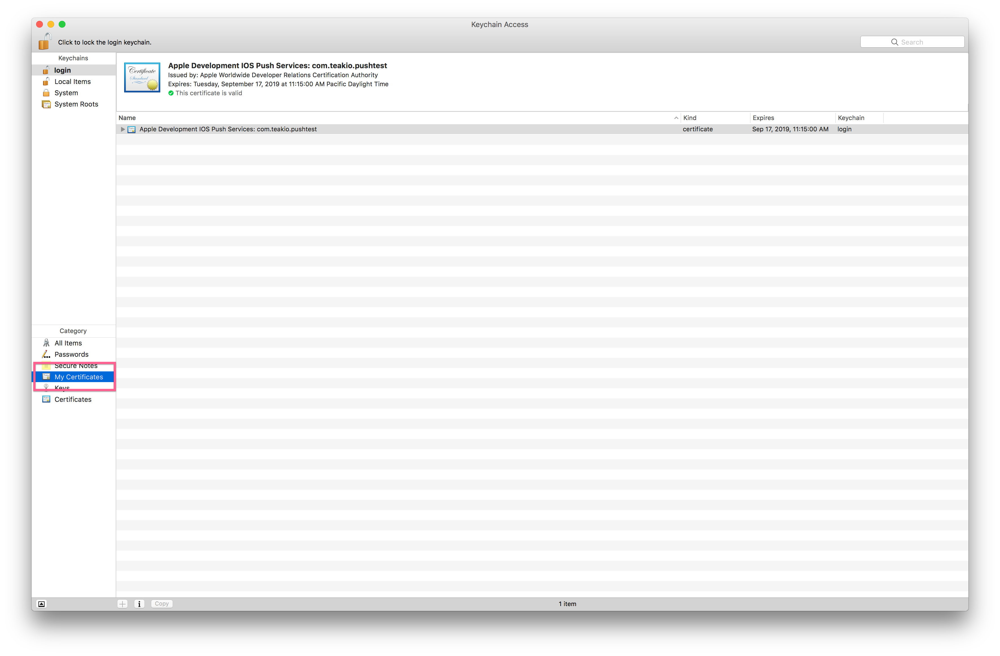

After selecting the certificate, go to **File -> Export Items...** in the main menu. Ensure that you have only selected one certificate!

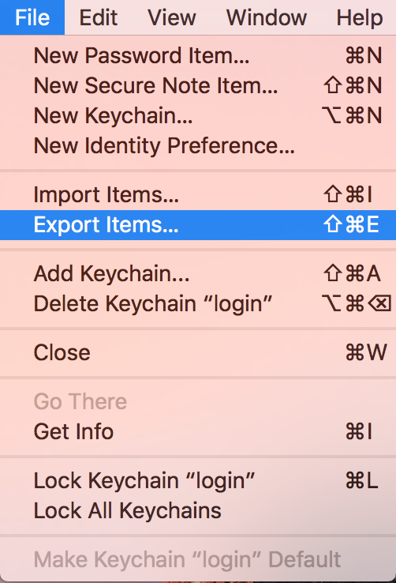

You will be prompted to save the certificate. Ensure that the **File Format** is **Personal Information Exchange (.p12)**. No other file format is acceptable. Save it to somewhere you can easily navigate to, because we will be uploading it to Teak shortly (you're almost there!)

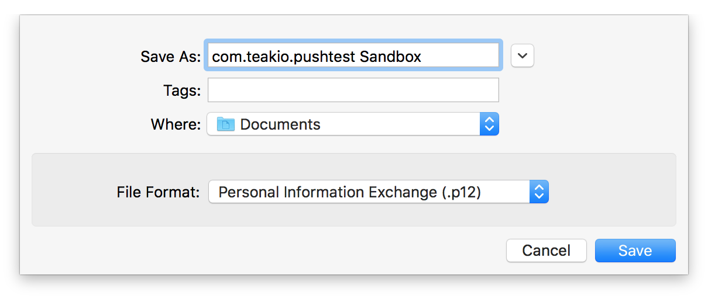

You will be prompted to add a password to protect the exported items. I suggest leaving this blank. If you do enter a password, you will later have to enter the same password into Teak.

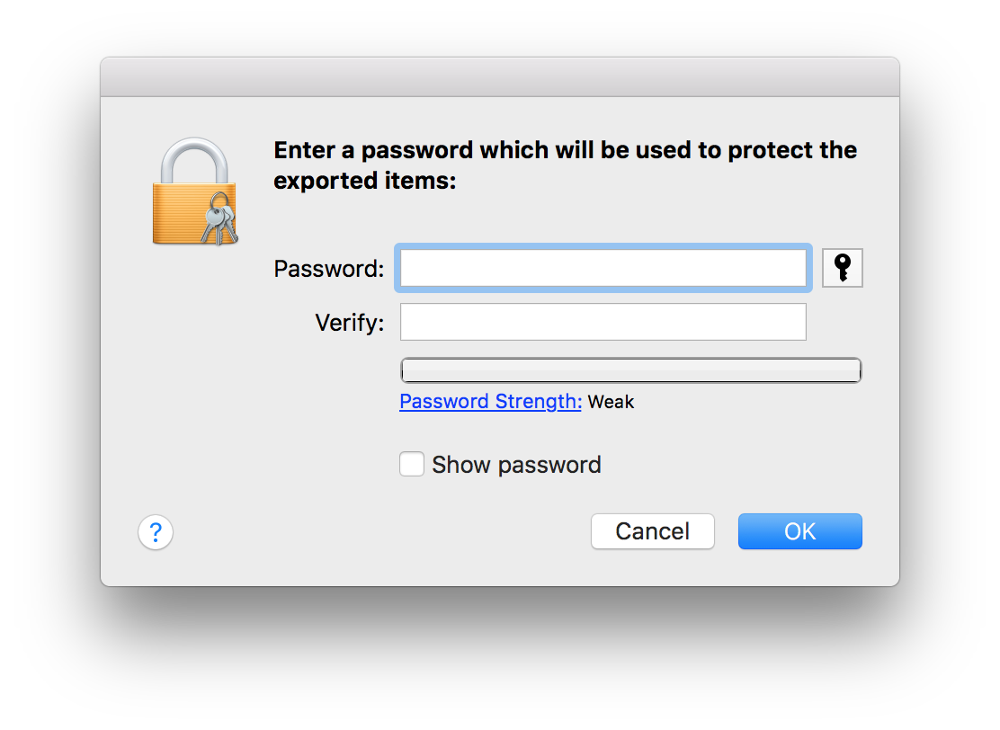

Uploading to Teak
-----------------

Now that the p12 is saved, we just have to add it to Teak! In the Teak Dashboard, navigate to **Settings -> Mobile** for your game, and click **Manage APNS Certificates** in the iOS section.

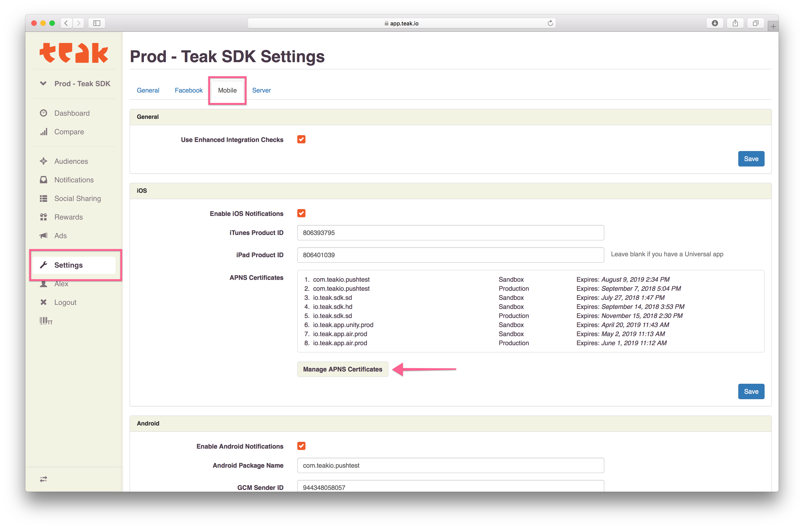

In the modal that appears, click **Choose p12 File** and select the p12 file you just exported. If you set a password for the p12 file, enter the password in the **Password (Optional)** field after selecting the p12.

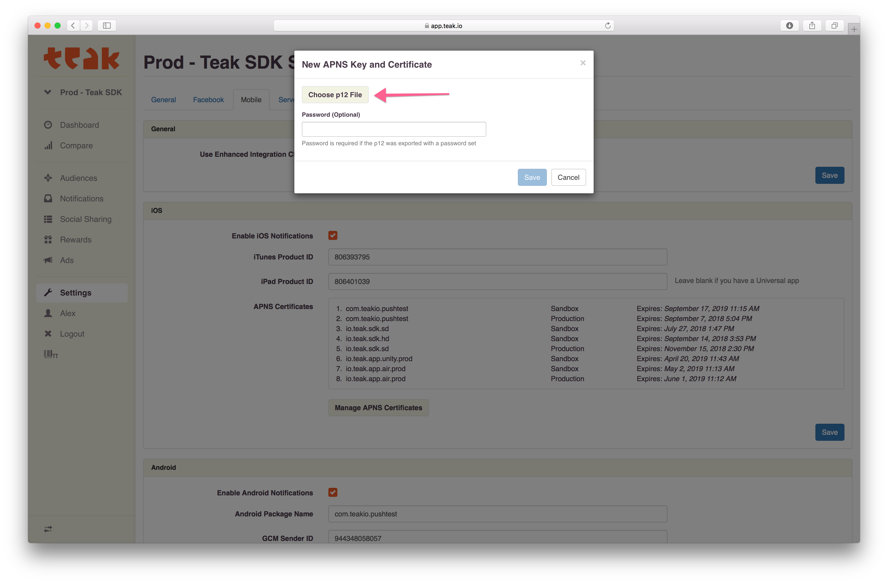

Teak will show you information about the p12 you are adding. Confirm that the bundle id matches the bundle id for your game, and that the expiration date is in the future. If everything looks good, click **Save** to upload and use the p12.

.. image:: images/apns-setup/teak-upload-done.png

You're done! I suggest repeating this process for the other environment (Sandbox or Production) now, while it's fresh in your mind. Note that you can upload as many certificates to a single Teak game as you need to, and you can upload the same certificate to multiple Teak games as well.
