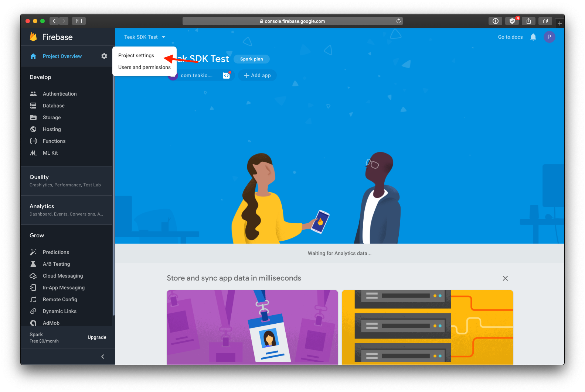
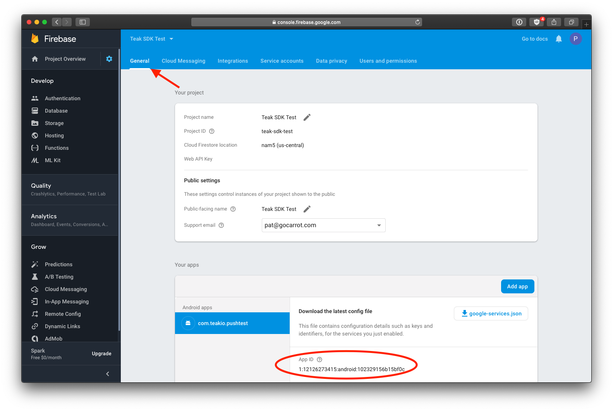

Finding your Firebase App Id
============================

To find the credentials for Android push configuration when using Firebase, go to your Firebase Dashboard and click the gear icon in the upper left corner, and click **Project settings**.

Now click on **General**.

The value in ``App ID`` is used for your ``Firebase App ID`` (``io_teak_firebase_app_id``) in the Teak Dashboard and in the Teak SDK (`Unity <https://teak.readthedocs.io/projects/unity/en/latest/android.html#edit-res-values-teak-xml>`_, `Adobe AIR <https://teak.readthedocs.io/projects/air/en/latest/android.html#set-up-teak-support-at-the-application-level>`_).
