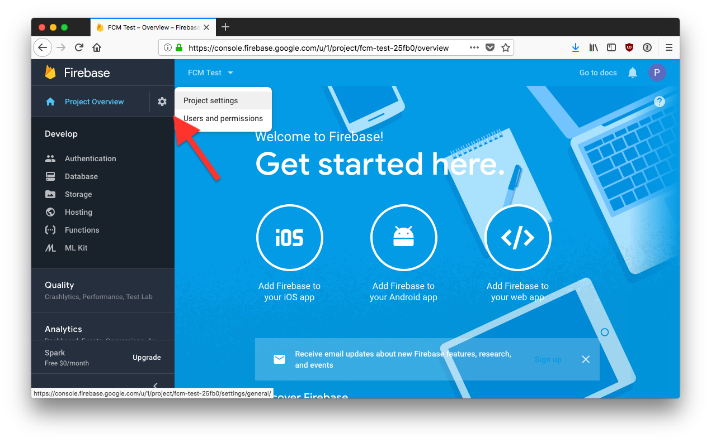
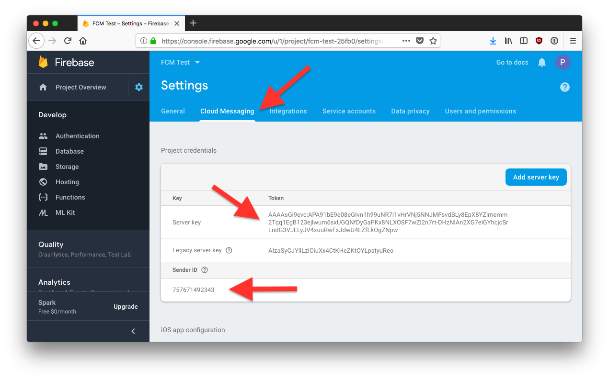
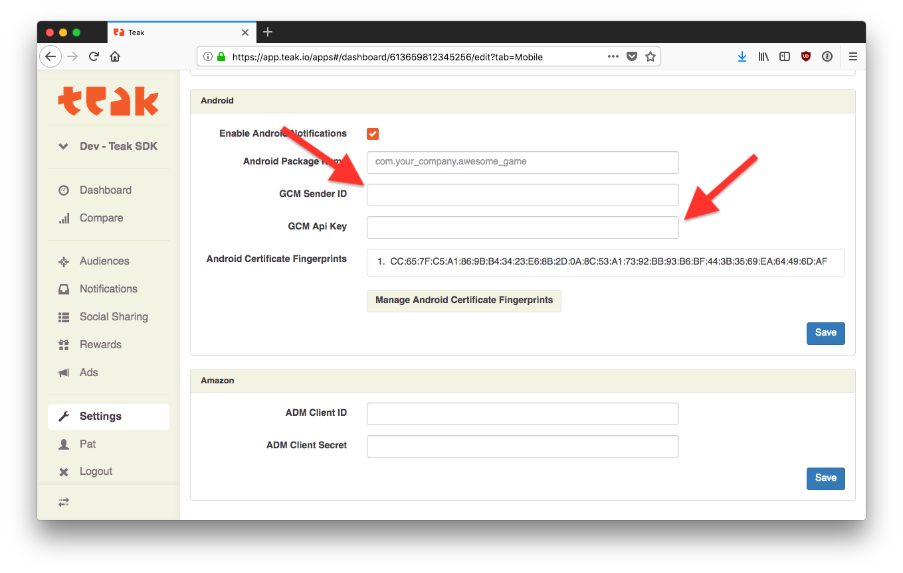

Finding your Android Push Credentials on Firebase
=================================================

To find the credentials for Android push configuration when using Firebase, go to your Firebase Dashboard and click the gear icon in the upper left corner, and click **Project settings**.

Now click on **Cloud Messaging**.

The value in ``Sender ID`` is used for your ``GCM Sender ID`` in the Teak Dashboard and in the Teak SDK (`Unity <https://teak.readthedocs.io/projects/unity/en/latest/android.html#edit-res-values-teak-xml>`_, `Adobe AIR <https://teak.readthedocs.io/projects/air/en/latest/android.html#set-up-teak-support-at-the-application-level>`_).

The value in ``Server key`` is used as your ``GCM Api Key`` in the Teak Dashboard

