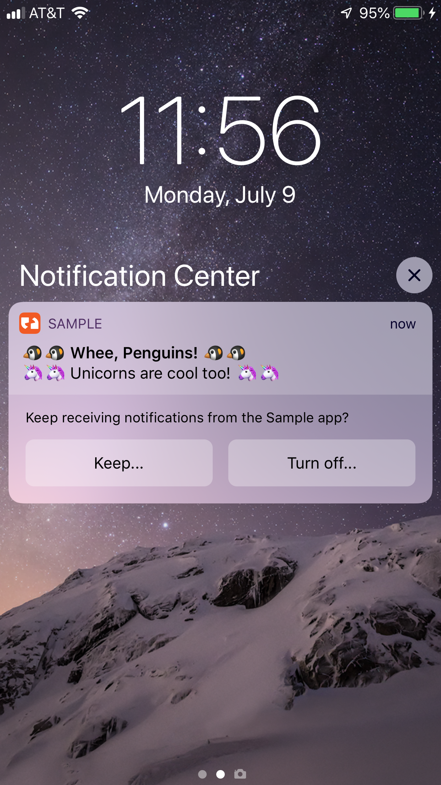
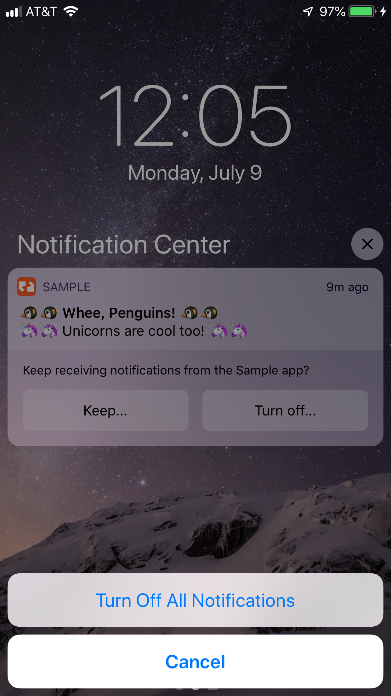
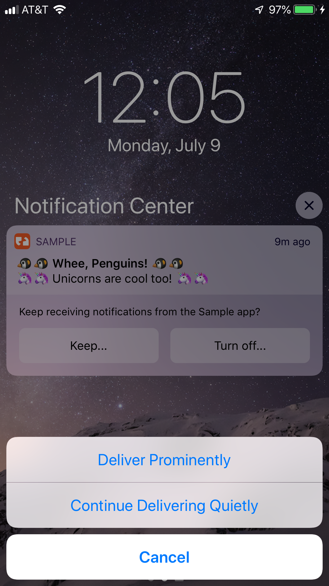
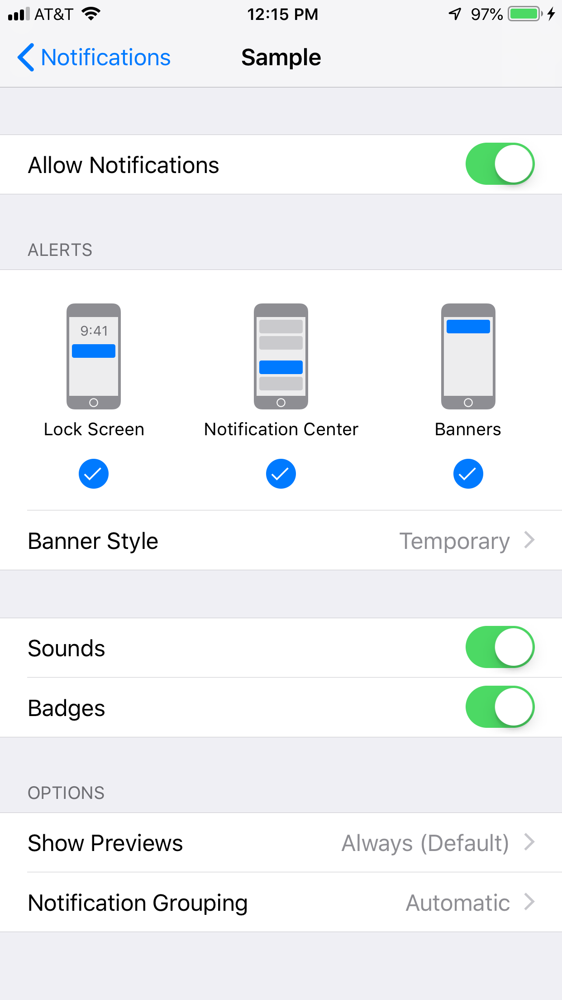
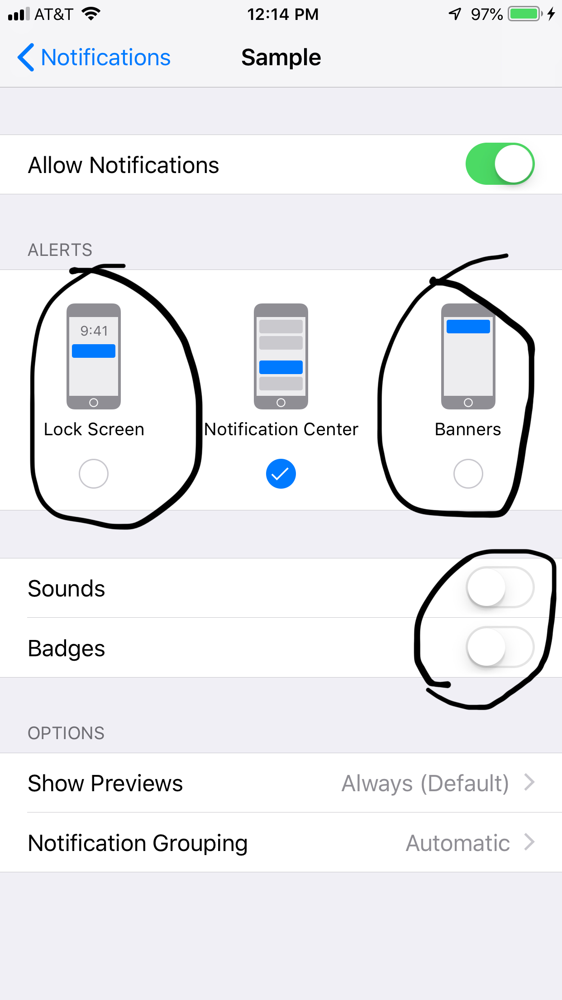
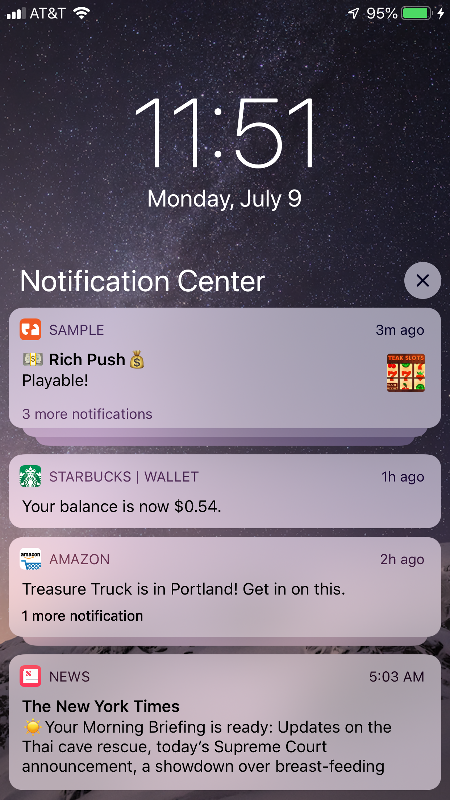
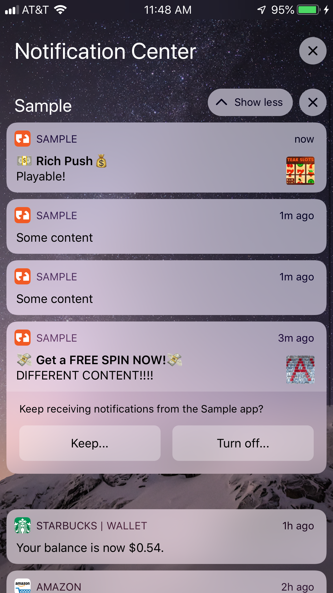

============================
iOS 12 Notification Features
============================
iOS 12 brings several new features to Local and Push Notifications.

.. important:: iOS 12 is still in beta, so there may be changes between when this document was written and the release of iOS 12.

Provisional Push Notifications
------------------------------
One of the most exciting new features of iOS 12 is the ability to send notifications on a 'provisional' basis.

Provisional push notifications **do not require you to request permissions from the user**!

Provisional notifications are shown only in the Notification Center, but not on the Lock Screen. They also offer the user the opportunity to turn off notifications from the app, or change the notifications to be delivered prominently.

.. note:: If you have any questions about Provisional Push Notifications, contact your Teak account rep.

The user will be prompted to confirm their choice if they press either button.

What Does 'Deliver Prominently' Mean?
^^^^^^^^^^^^^^^^^^^^^^^^^^^^^^^^^^^^^
Deliver Prominently means that the notification will show on the Lock Screen, in the Notification Center, and Banners. It will also play a sound and badge the app when it arrives.

This is what the Settings look like for notifications delivered prominently.

What Does 'Deliver Quietly' Mean?
^^^^^^^^^^^^^^^^^^^^^^^^^^^^^^^^^
Deliver Quietly means that the notification will only show up in the Notification Center. The user will not be alerted via sound or vibration when the notification arrives.

This is what the Settings look like for a notification delivered quietly. The differences between 'Deliver Quietly' and 'Deliver Prominently' are circled.

Interesting Observed Behaviors
^^^^^^^^^^^^^^^^^^^^^^^^^^^^^^
If a user is prompted to explicitly authorize notifications, and they are sent a notification while they still have a provisional notification, both notifications will display in the Notification Center, and the notifications sent with provisional authorization will still display the buttons prompting the user.

.. image:: images/ios-12-provisional-and-authorized.png
    :scale: 25 %

These buttons will perform the described actions if pressed, overwriting the current (authorized) status.

Notification Stacking
---------------------
In iOS 12, subsequent notifications from the same app will be displayed in an abridged form. Notifications will be stacked in the order they were received, with the most recent notification always be displayed at the top of the stack.

This is an example of how they will look, both stacked and expanded.

Provisional notifications also use this behavior, with only the final item displayed in the list showing the prompt buttons.
