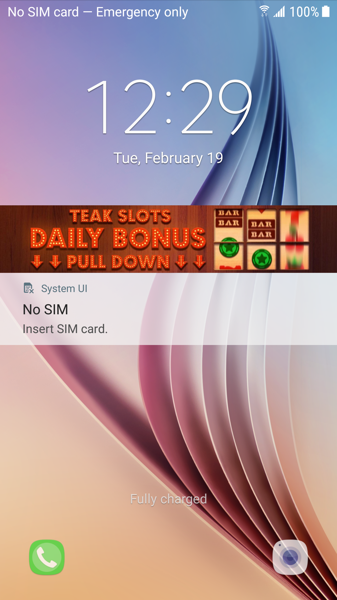
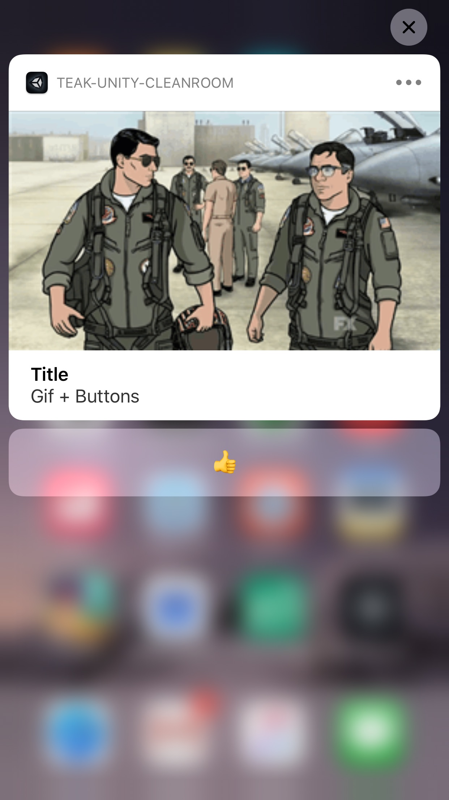

Notification Content Guidelines
===============================
These are the notification content guidelines that we have established by using test patern images and pixel grids on numerous different Android devices to establish image sizes that will maintain aspect ratio, and "safe areas" inside those sizes in which the content will always be displayed.

Safe Areas
----------
When we refer to a 'safe area' in an image, what that means is that you should only place critical content (especially text) inside that area. The area outside the 'safe area' will be displayed on some devices, but not on others.

At this time, all colors are assumed to be safe, and there is no need for a 'safe range' of color values.

Inline Content Guidelines
-------------------------
The content guideliens are also displayed anywhere in the Teak dashboard which allows you to upload content.

If those guidelines are different from the guidelines in this document, follow the guidelines on the dashboard, and please let us know about the discrepancy.

Android
-------

Banner View
^^^^^^^^^^^
The banner view of an Android Notification is used in both the toast view, and the notification center.

.. image:: images/android-banner-notification-center-sm-g920t.png
    :width: 45 %

.. admonition:: Banner View Content

    1700x300 **png**, **jpg**, or **mp4**. Only a centered 1300x300 is 'safe' for content.

    The recommended size guarantees native resolution display on xxxhdpi screens, if the content is too large it can be cut in half to 850x150.

Expanded View
^^^^^^^^^^^^^
The expanded view of an Android notification is used in the notification center.

.. image:: images/android-expanded-sm-g920t.png
    :width: 45 %

.. admonition:: Expanded View Content

    1700x850 **png**, **jpg**, or **mp4**. The entire area is 'safe' for content.

    The recommended size guarantees native resolution display on xxxhdpi screens, if the content is too large it can be cut in half to 850x425.

iOS
---

Expanded View
^^^^^^^^^^^^^
The expanded view of an iOS notification is used when the user force-touches on a notification.

.. admonition:: Expanded View Content

    1100x620 **png**, **jpg**, **gif**, or **mp4**. The entire area is 'safe' for content.

    *In general* iOS will be fine with any size you give it. The recommend size guarantees native resolution display on the X series, but you can give it larger content or reuse your Android expanded view.

