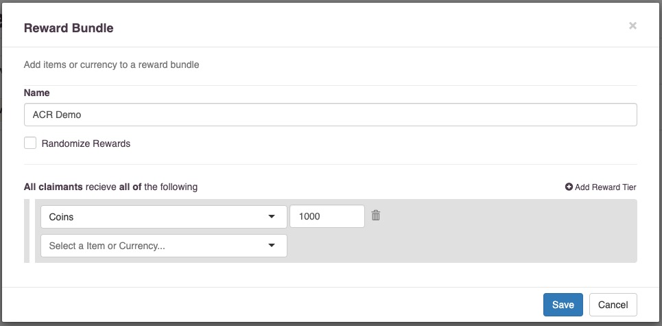
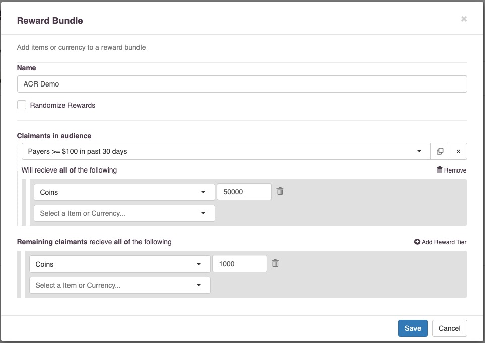
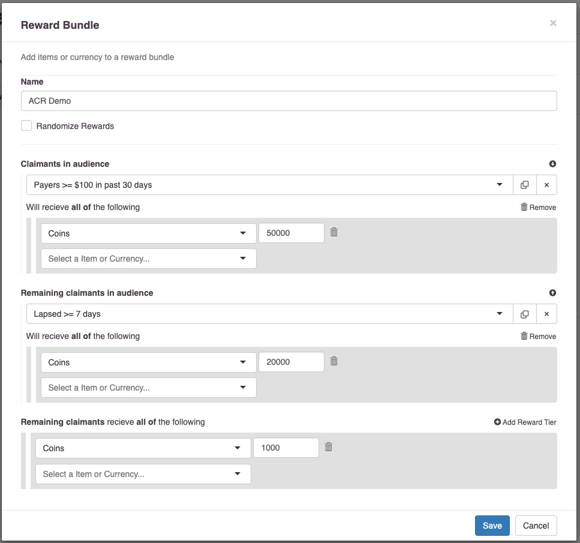
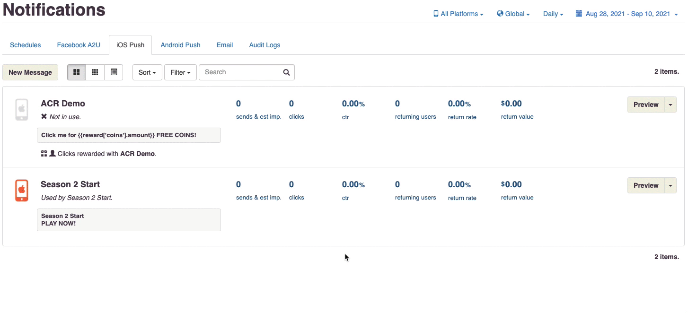
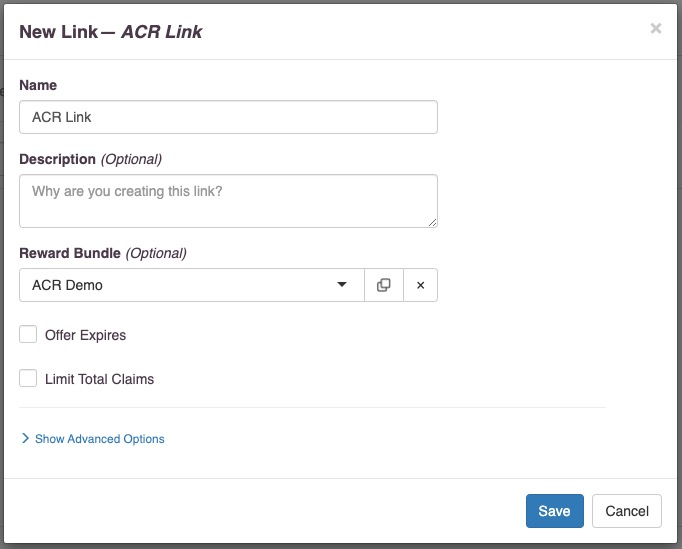

Audience Controlled Rewards
===========================
It's common to want to use the same messaging strategy for a large group of players but offer a different reward to different players based on their past activity. For example, you may want to send a push notification to all players who are at risk of churning, but give more free in-game currency to players who have previously purchased than to players who have never purchased.

Teak provides Audience Controlled Rewards, or ACR, to support this. With ACR you can set up a Reward Bundle which provides different rewards to different players depending on their membership in any Audience, and then reuse this Reward Bundle across any number of notifications, emails, or links.

Additionally when an ACR Bundle is used for a notification, email, or link, Teak will provide all relevant metrics split out by all audiences in the ACR Bundle.

Creating an Audience Controlled Reward Bundle
---------------------------------------------
All Reward Bundles are automatically ACR Bundles. Initially, the bundle only contains a single audience, the default "All Other Players" audience which will match all players who did not match any other audience.

   An ACR Bundle with one reward tier

To add another reward tier to the bundle, click "Add Reward Tier". This will add a new section to the Bundle which allows you to select an Audience and modify the reward for claimants in that audience.

   With this ACR Bundle, players who have spent at least $100 in the past 30 days will get 50,000 coins, and all other players will get 1,000 coins.

You may select any Audience, including Audiences created through an uploaded list, to apply the reward tier to.

To add additional tiers, click on "Add Reward Tier" again. There is no limit on the number of reward tiers a single ACR Bundle may contain.

How Teak Uses an ACR Bundle
---------------------------
Teak will determine which reward tier a player should receive at "reward evaluation time" for the type of creative the bundle is attached to. For Facebook App-to-User notifications, iOS and Android push and local notifications, and email, this is at the time the notification is sent. For links, this is at the time the link is clicked.

To determine which reward tier a player should receive, Teak will go through the ACR Bundle in order and select the first tier that the player matches.

Example
^^^^^^^

   With this ACR Bundle, players who have spent at least $100 in the past 30 days will receive 50,000 coins, players who have been lapsed for at least 7 days will receive 20,000 coins, and everyone else will receive 1,000 coins.

Let's imagine 4 players who are claiming this reward

- Alice, who has spent $200 in the past 30 days, and plays every day
- Bob, who has spent $120 in the past 30 days, but has not played for 10 days
- Erin, who has spent $80 in the past 30 days, and plays every day
- Frank, who has not spent any money in the past 30 days, and has not played for 7 days

Alice, who has spent $200 in the past 30 days, is in the "Payers >= $100 in past 30 days" audience, and so will receive the first reward tier for 50,000 coins.

Bob, who has spent $120 in the past 30 days, is in the "Payers >= $100 in past 30 days" audience, and so will receive the first reward tier for 50,000 coins. Even though Bob is also in the "Lapsed >= 7 days" audience, because he matched the first reward tier, Teak stopped processing him and so he will only receive the first reward tier.

Erin, who has spent $80 in the past 30 days, is not in the "Payers >= $100 in past 30 days" audience, so Teak will continue processing. Erin also plays every day, and so is not in the "Lapsed >= 7 days" audience, so Teak will continue processing. As the only tier remaining is the catchall Remaining claimants tier, Erin will receive 1,000 coins.

Frank, who has not spent any money in the past 30 days, is not in the "Payers >= $100 in past 30 days" audience, so Teak will continue processing. Frank has not played for 7 days, so he is in the "Lapsed >= 7 days" audience, and will receive the second reward tier for 20,000 coins.

Remember, this process takes place at reward evaluation time. For a notification or email that will be at send time, while for a link that will be at click time. In this example, if the ACR Bundle was associated with a notification, even if Erin made a $20 purchase and entered the "Payers >= $100 in past 30 days" audience before tapping on the notification, she would still receive only 1,000 coins from the catchall Remaining claimants tier because at the time of send she was not in the "Payers >= $100 in past 30 days" audience. However, if the ACR Bundle was associated with a link, Erin would now receive the first reward tier for 50,000 coins on clicking the link, as the evaluation would take place at the time of the click.

Using With Notifications
------------------------
Teak provides the ability to template the reward a player will receive from an ACR Bundle into notification content (Facebook A2U, iOS local or push, Android local or push, or Email). Because the reward is selected at send time the templated content will accurately reflect what reward the player will receive, even if they change audience membership prior to tapping on the notification.

To template the reward into a notification, first select the ACR Bundle as the Reward Bundle for the notification. After doing so, Teak will automatically add available template tags to the templating dropdown for all notification fields.

.. figure:: ../images/rewards/notif_template.jpg
   :alt: Inserting the "Coins Amount" template tag will template the number of coins the player will receive based on their selected reward tier from the ACR Bundle.

   Inserting the "Coins Amount" template tag will template the number of coins the player will receive based on their selected reward tier from the ACR Bundle.

We recommend templating the reward amount into all notifications which use an ACR Bundle. Testing has shown that informing a player of the specifics of the reward they will receive (e.g. Click me for 50,000 FREE COINS! vs. Click me for tons of FREE COINS!) increases click through rate by 10-15% relative to baseline.

After a notification with an ACR Bundle has been sent you can view all :doc:`notification metrics <notification-metrics>` broken out by the selected reward tier. To do so, in a notification content tab, switch to table view and then select "Show Audience Rewards (Table View Only)" from the filter dropdown.

   Viewing per-audience metrics for a notification using an ACR Bundle.

Using With Links
----------------
To use an ACR Bundle with a Link, simply create a Link and select an ACR Bundle as its Reward Bundle.

   A link with an ACR Bundle.

All link features including expiration, claim limitation, and deep linking, are compatible with ACR Bundles. Expiration and claim limits will apply across all reward tiers combined. For example, if you create a link with an ACR Bundle and Limit Total Claims to 5 players, only 5 players will be able to claim any rewards from the link, regardless of selected reward tier.

After creating a link with an ACR Bundle you can view all link metrics broken out by the selected reward tier. To do so, switch to table view.

.. figure:: ../images/rewards/link_metrics.gif
   :alt: Viewing per-audience metrics for a link using an ACR Bundle.

   Viewing per-audience metrics for a link using an ACR Bundle

Editing ACR Bundles
-------------------
An ACR Bundle may be modified after it has been created, and even after it has been used. You may add, remove, or rearrange reward tiers, change which audiences are associated with tiers, and change the rewards that each tier gives out.

If the modified ACR Bundle is attached to a link, all changes take effect immediately and apply to all future clicks on the link.

If the modified ACR Bundle is attached to a notification, then it changes the behavior of how that notification assigns rewards. After modifying an ACR Bundle attached to a notification, Teak will invalidate the rewards chosen at notification send time and will instead treat a click on the notification the same way it would a click on a link, and will select a reward tier based on the player's audience membership at notification click time.

This is done so that if you discover that there was an error in your ACR Bundle configuration after a notification was sent you can still modify the bundle and limit potential damages. For example, if you accidentally gave all remaining claimants 1,000,000 coins instead of 1,000 coins and did not catch this until after sending a notification, you could edit the ACR Bundle and immediately all future clicks on the previously sent notification would issue the corrected reward.

Note that this will mean that any templated notification text is incorrect which may result in player complaints, so we strongly encourage you to double check all ACR Bundle configurations before using them in a notification.
