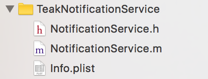
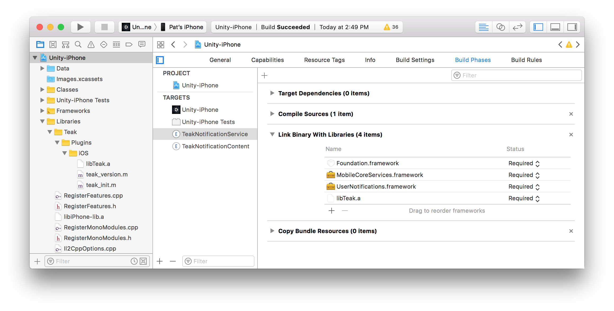
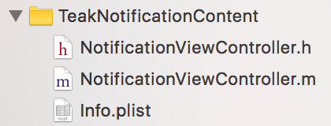
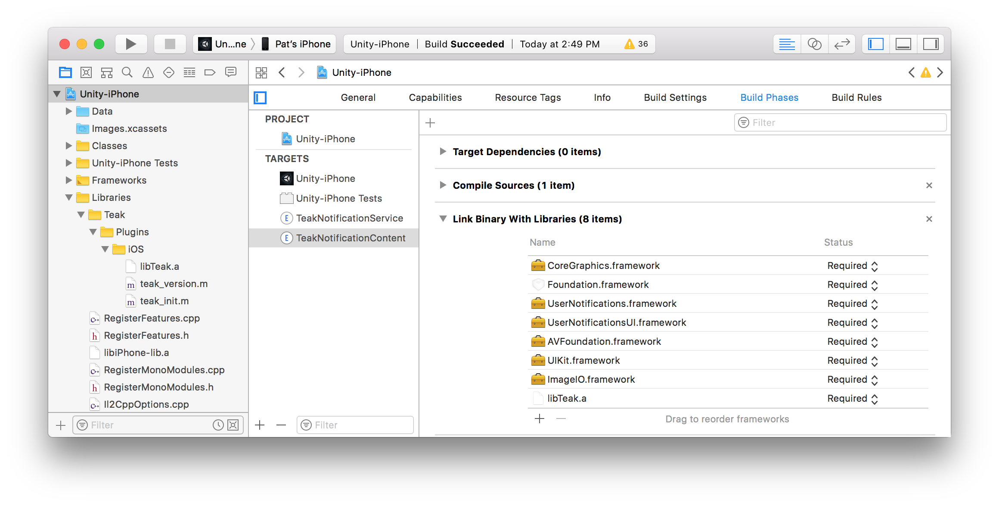
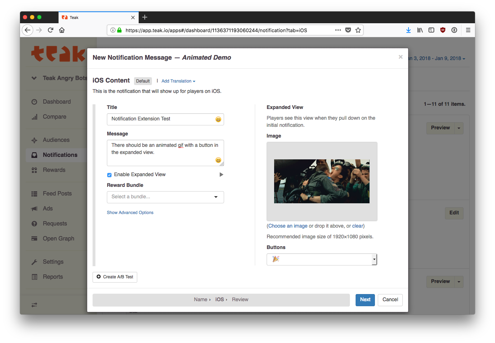
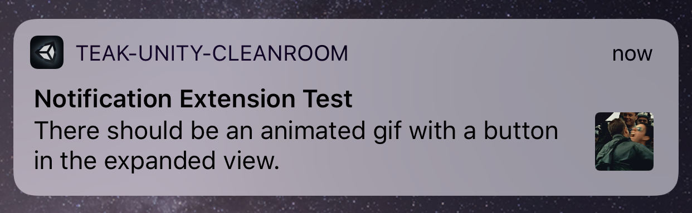
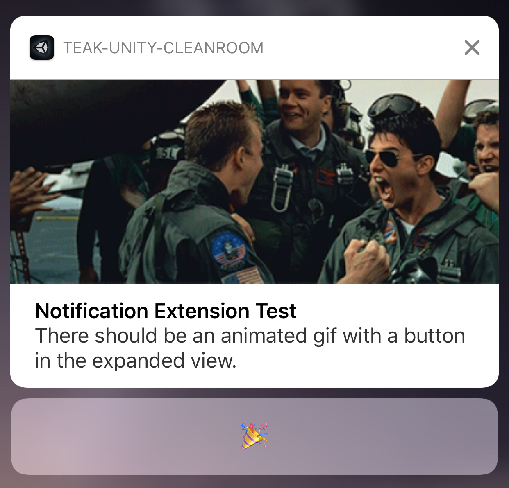

.. |br| raw:: html

    

iOS Notification Extensions
===========================
Do you want Playable Notifications? Buttons in your notifications? You need to do these things!

.. important:: This functionality **is safe for all versions of iOS**, but will
    only be displayed on iOS 10+

This document assumes that you have a working Xcode project for a game with Teak.

Notification Service Extension
------------------------------
Go to: **File** > **New** > **Target** and choose `Notification Service Extension`

Name it ``TeakNotificationService``

This will create a group in your Xcode project that looks like this:

Dependencies
^^^^^^^^^^^^

Add ``UserNotifications.framework``, ``MobileCoreServices.framework``, ``UIKit.framework``, ``SystemConfiguration.framework`` and ``libTeak.a`` to the `Link Binary with Libraries` Build Phase of the extension:

.. note:: You can find ``libTeak.a`` in ``Libraries/Teak/Plugins/iOS`` in the Xcode project structure, and drag it into the 'Link Binary with Libraries' step.

.. highlight:: objc

Code
^^^^

Change the code in ``TeakNotificationService/NotificationService.h`` to look like this::

    #import <UserNotifications/UserNotifications.h>

    // This is the declaration of `TeakNotificationServiceCore`, the implementation
    // is in 'libTeak.a'. It is done this way so you do not need to fight with
    // include paths.
    @interface TeakNotificationServiceCore : UNNotificationServiceExtension
    - (void)serviceExtensionTimeWillExpire;
    @end

    @interface TeakNotificationService : TeakNotificationServiceCore
    - (void)serviceExtensionTimeWillExpire;
    @end

This declares ``TeakNotificationServiceCore`` and inherets from it, which will pull in the functionality from ``libTeak.a`` which will take care of everything else.

Change the code in ``TeakNotificationService/NotificationService.m`` to look like this::

    #import "NotificationService.h"

    @implementation TeakNotificationService
    - (void)serviceExtensionTimeWillExpire {
        [super serviceExtensionTimeWillExpire];
    }
    @end

Notification Content Extension
------------------------------
Go to: **File** > **New** > **Target** and choose `Notification Content Extension`

Name it ``TeakNotificationContent``

.. note:: **Delete** the auto-generated ``NotificationViewController.storyboard`` from your project.

You should now have a group in your Xcode project that looks like this:

Dependencies
^^^^^^^^^^^^

Add ``UserNotifications.framework``, ``UserNotificationsUI.framework``, ``AVFoundation.framework``, ``UIKit.framework``, ``ImageIO.framework``, ``CoreGraphics.framework`` and ``libTeak.a`` to the `Link Binary with Libraries` Build Phase of the extension:

.. note:: You can find ``libTeak.a`` in ``Libraries/Teak/Plugins/iOS`` in the Xcode project structure, and drag it into the 'Link Binary with Libraries' step.

Code
^^^^

Change the code in ``TeakNotificationContent/NotificationViewController.h`` to look like this::

    #import <UIKit/UIKit.h>

    // This is the declaration of `TeakNotificationViewControllerCore`, the implementation
    // is in 'libTeak.a'. It is done this way so you do not need to fight with
    // include paths.
    @interface TeakNotificationViewControllerCore : UIViewController
    - (void)viewDidLoad;
    @end

    @interface TeakNotificationViewController : TeakNotificationViewControllerCore
    - (void)viewDidLoad;
    @end

Change the code in ``TeakNotificationContent/NotificationViewController.m`` to look like this::

    #import "NotificationViewController.h"

    @implementation TeakNotificationViewController
    - (void)viewDidLoad {
        [super viewDidLoad];
    }
    @end

Plist
^^^^^

.. highlight:: xml

Open ``TeakNotificationContent/Info.plist`` *with a text editor* and replace the contents with::

    <?xml version="1.0" encoding="UTF-8"?>
    <!DOCTYPE plist PUBLIC "-//Apple//DTD PLIST 1.0//EN" "http://www.apple.com/DTDs/PropertyList-1.0.dtd">
    <plist version="1.0">
    <dict>
        <key>CFBundleDevelopmentRegion</key>
        <string>$(DEVELOPMENT_LANGUAGE)</string>
        <key>CFBundleDisplayName</key>
        <string>TeakNotificationContent</string>
        <key>CFBundleExecutable</key>
        <string>$(EXECUTABLE_NAME)</string>
        <key>CFBundleIdentifier</key>
        <string>$(PRODUCT_BUNDLE_IDENTIFIER)</string>
        <key>CFBundleInfoDictionaryVersion</key>
        <string>6.0</string>
        <key>CFBundleName</key>
        <string>$(PRODUCT_NAME)</string>
        <key>CFBundlePackageType</key>
        <string>XPC!</string>
        <key>CFBundleShortVersionString</key>
        <string>1.0</string>
        <key>CFBundleVersion</key>
        <string>1</string>
        <key>NSExtension</key>
        <dict>
            <key>NSExtensionAttributes</key>
            <dict>
                <key>UNNotificationExtensionCategory</key>
                <array>
                    <string>TeakNotificationContent</string>
                    <string>TeakNotificationPlayNow</string>
                    <string>TeakNotificationClaimForFree</string>
                    <string>TeakNotificationBox123</string>
                    <string>TeakNotificationGetNow</string>
                    <string>TeakNotificationBuyNow</string>
                    <string>TeakNotificationInteractiveStop</string>
                    <string>TeakNotificationLaughingEmoji</string>
                    <string>TeakNotificationThumbsUpEmoji</string>
                    <string>TeakNotificationPartyEmoji</string>
                    <string>TeakNotificationSlotEmoji</string>
                    <string>TeakNotification123</string>
                    <string>TeakNotificationFreeGiftEmoji</string>
                    <string>TeakNotificationYes</string>
                    <string>TeakNotificationYesNo</string>
                    <string>TeakNotificationAccept</string>
                    <string>TeakNotificationOkay</string>
                    <string>TeakNotificationYesPlease</string>
                    <string>TeakNotificationClaimFreeBonus</string>
                </array>
                <key>UNNotificationExtensionDefaultContentHidden</key>
                <false/>
                <key>UNNotificationExtensionInitialContentSizeRatio</key>
                <real>0.01</real>
            </dict>
            <key>NSExtensionPointIdentifier</key>
            <string>com.apple.usernotifications.content-extension</string>
            <key>NSExtensionPrincipalClass</key>
            <string>TeakNotificationViewController</string>
        </dict>
    </dict>
    </plist>

.. note:: You can also download the latest copy of this PList here https://s3.amazonaws.com/teak-build-artifacts/ios/Info.plist

Testing
-------
Set up an iOS notification with an expanded view using both a button and an animated GIF.

Make it a happy one, so you can celebrate. Here's a classic https://media.giphy.com/media/d86kftzaeizO8/200.gif

Preview the notification, and send it to your test device. The preview should look like this:

The expanded view should look like this:

I see the GIF, but no buttons
^^^^^^^^^^^^^^^^^^^^^^^^^^^^^
Check to make sure that ``TeakNotificationViewController`` is being built properly, and that ``TeakNotificationContent/Info.plist`` contains the contents as specified above.

I see no small image preview
^^^^^^^^^^^^^^^^^^^^^^^^^^^^
Make sure that ``TeakNotificationService`` is being built properly.

.. tip:: We use a Ruby script for automating this process during our testing. Feel free to
    use it for your own build process as well. |br|
    https://github.com/GoCarrot/teak-ios/blob/master/TeakExtensions/add_teak_extensions.rb

