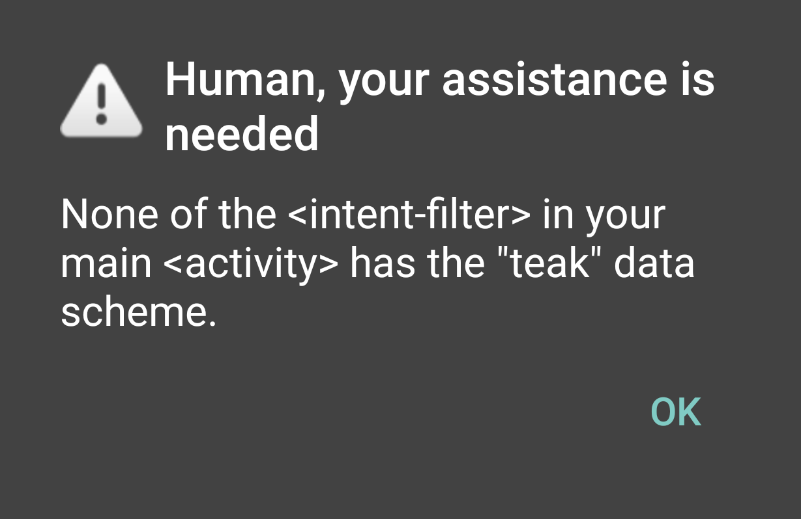
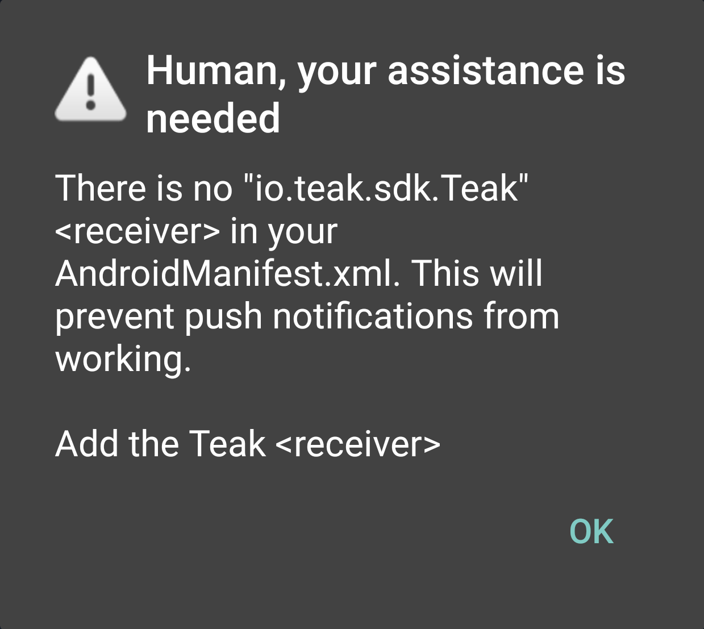

It Broke
========
Well, crap.

Here's a list of common errors, and what causes them.

iOS
---
:ref:`ios-edit-info-plist`.

Android
-------
.. highlight:: xml

If You See
^^^^^^^^^^
::

    E/Teak.Integration: Failed to find R.string.io_teak_api_key

or::

    E/Teak.Integration: Failed to find R.string.io_teak_app_id

or::

    E/Teak.Integration: R.string.io_teak_gcm_sender_id not present or empty, push notifications disabled.

This means that the XML values for Teak are not present. You need to :ref:`android-edit-teak-xml`.

If You See
^^^^^^^^^^
::

    E/Teak.Integration: Missing dependencies: com.android.support:support-core-utils:26+

You are missing the dependency ``com.android.support:support-core-utils:26+``

If You See
^^^^^^^^^^
::

    E/Teak.Integration: Missing dependencies: com.android.support:support-compat:26+

You are missing the dependency ``com.android.support:support-compat:26+``

If You See
^^^^^^^^^^
::

    E/Teak.Integration: Missing dependencies: com.google.android.gms:play-services-base:10+, com.google.android.gms:play-services-basement:10+

You are missing the dependencies ``com.google.android.gms:play-services-base:10+`` and ``com.google.android.gms:play-services-basement:10+``

If You See
^^^^^^^^^^
::

    E/Teak.Integration: Missing dependencies: com.google.android.gms:play-services-gcm:10+

You are missing the dependency ``com.google.android.gms:play-services-gcm:10+``

If You See
^^^^^^^^^^
::

    E/Teak.Integration: Missing dependencies: com.google.android.gms:play-services-iid:10+

You are missing the dependency ``com.google.android.gms:play-services-iid:10+``

If You See
^^^^^^^^^^

You are missing an ``<intent-filter>`` with ``<data android:scheme="teakYOUR_TEAK_APP_ID" android:host="*" />``

You need to :ref:`android-set-up-deep-linking`.

.. note:: This warning will only show up on apps that have enabled '**Use Enhanced Integration Checks**' on the Teak Mobile Settings Dashboard.

If You See
^^^^^^^^^^

You are missing the Teak ``<receiver>`` for GCM (push) notifications.

You need to :ref:`android-set-up-push-notifications`.

.. note:: This warning will only show up on apps that have enabled '**Use Enhanced Integration Checks**' on the Teak Mobile Settings Dashboard.
